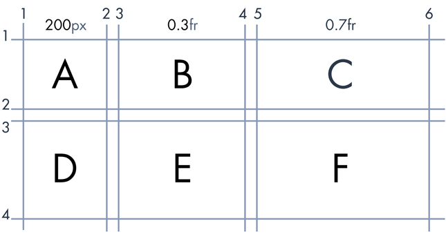
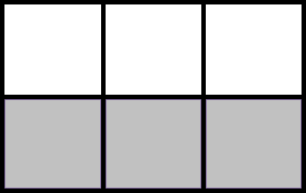
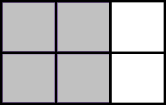

# Experimento com a disposição de grade via CSS

[](http://hemersonvianna.mit-license.org/)
[](https://github.com/org-victorinox/experiment-css-grid-layout/issues)


## Traduções

* [ORIGINAL](https://github.com/org-victorinox/experiment-css-grid-layout/)

## Suporte 

- Chrome 29+(Ativando a Bandeira)
- Firefox 40+(Ativando a Bandeira)
- Opera 28+(Ativando a Bandeira)
- IE 10+

Apenas IE 10+ e Edge dão suporte a `CSS grid`. Ele pode ser habilitado no Chrome através da bandeira `Recursos experimentais da Plataforma Web` em `chrome://flags`, na barra de endereço do navegador. Você pode habilitá-lo no Firefox usando o sinalizador `layout.css.grid.enabled`.

## Terminologia

A unidade `fr`: Esta unidade é usada para especificar uma fração do espaço disponível. Ele foi criado para ser usado com `grid-rows` e `grid-columns`.

```html
<div class="grid-container">
  <div class="grid-element item-a">A</div>
  <div class="grid-element item-b">B</div>
  <div class="grid-element item-c">C</div>
  <div class="grid-element item-d">D</div>
  <div class="grid-element item-e">E</div>
  <div class="grid-element item-f">F</div>
</div>
```

```css
.grid-container {
  display: grid;
  grid-template-columns: 200px 10px 0.3fr 10px 0.7fr;
  grid-template-rows: auto 20px auto;
}
```



### Grid Container

O elemento no qual `display: grid` é aplicada. É o pai direto de todos os itens da grade.

```html
<div class="grid-container">
  <div class="grid-item item-1"></div>
  <div class="grid-item item-2"></div>
</div>
```

```css
.grid-container { display: grid; }
```

### Grid Item

Filhos diretos do `grid container`. Aqui, os elementos `grid-item` são itens da grade, mas os `grid-subitem` não são.

```html
<div class="grid-container">
  <div class="grid-item item-1">
    <div class="grid-subitem"></div>
  </div>
  <div class="grid-item item-2"></div>
</div>
```

### Grid Line

As linhas divisórias que formam a estrutura da grade. Eles podem ser tanto verticais (column grid lines) ou horizontais (row grid lines) e residir em ambos os lados de uma linha ou coluna.


### Grid Track

O espaço entre as duas linhas adjacentes da grade. Você pode pensar neles como as colunas ou linhas da grade. Aqui é a área da grade entre as segunda e terceira linhas.



### Grid Cell

O espaço entre duas linhas adjacentes e duas linhas de colunas adjacentes. É uma única **unidade** da grade. Aqui é a célula da grade entre a linha 1 e 2, e linhas de coluna 2 e 3.


### Grid Area

O espaço total cercado por quatro linhas da grade. A área da grade pode ser constituída por qualquer número de células. Aqui está a área da grade entre as linhas 1 e 3, e linhas de coluna 1 e 3.



## Propriedades

### Propriedades para o Grid Container

- display
  - grid 
  - inline-grid
- grid-template-columns
- grid-template-rows
- grid-template-areas
- grid-column-gap
- grid-row-gap
- grid-gap
- justify-items
- align-items
- justify-content
- align-content
- grid-auto-columns
- grid-auto-rows
- grid-auto-flow
- grid

### Propriedades para os Grid Items

- grid-column-start
- grid-column-end
- grid-row-start
- grid-row-end
- grid-column
- grid-row
- grid-area
- justify-self
- align-self

## Referências

- [A Complete Guide to Grid](https://css-tricks.com/snippets/css/complete-guide-grid/)
- [CSS Grid Layout Module Level 1](https://www.w3.org/TR/css-grid-1/)
- [Introducing the CSS Grid Layout](http://www.sitepoint.com/introducing-the-css-grid-layout/)

## Contribuindo

- Faça o fork!
- Crie a sua branch feature: `git checkout -b my-new-feature`
- Faça o commit das suas alterações: `git commit -m 'Add some feature'`
- Faça o push para o servidor: `git push origin my-new-feature`
- E realize o pull request

## Log

Verifique os [Releases](https://github.com/org-victorinox/experiment-css-grid-layout/releases) ver detalhado o log de alterações.

## Licença

[MIT license](http://hemersonvianna.mit-license.org/) © Hemerson Vianna
